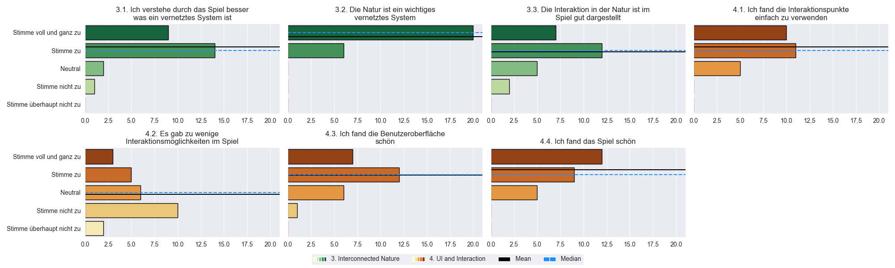

# Google Survey Visualization

This is a simple Python Script to create combined subplots of user surveys which use the standard survey/test scaling from 1...5 (Heavy Disagree...Strongly Agree)

Additionally it uses Color Maps to color code the different parts of our survey

An Example of a generated Image looks like this:

<p align=center>
    <a href="./README.md">
        
    </a>
    <br>

</p>

This Code should be easily transferable for other survey results using the same scale

## Usage

This is our main method to generate our plot-images
```python
   def plot_subplot(column_count, row_count, df_columns, colorlist, name, deleteLastPlot=False, XLabel=''):
```

**column_count:** amount of columns for image generation<br>
**row_count:** amount of rows for image generation<br>
**df_columns:** Dataframe that includes all the columns we want to plot<br>
**colorlist:** List of ColorMaps or Colors *(needs to be specified for every plot)*<br>
**name:**, filename we use to save in image folder<br>
**deleteLastPlot:** Default: False, If True: removes bottom right (last) plot if we have an odd amount of plots<br>
**XLabel:** Bottom label for all the plots, used to specify what Sub-Survey the questions belong to<br><br>
You can easily generate a **list of colormaps** with the right amount (for every column)
```python
    c_map = ['OrRd', 'BuPu', 'YlGn', 'YlOrBr']
    col_list = [c_map[0] for i in range(len(Lists[0].columns))] + [c_map[1] for i in range(len(Lists[1].columns))]
```
Here we generate 2 lists of repeating [colormaps](https://matplotlib.org/stable/tutorials/colors/colormaps.html) from the amount of columns in our seperated datasets (seperated by Sub-Survey)

## Acknowledgements

This [Article](https://towardsdatascience.com/cleaning-analyzing-and-visualizing-survey-data-in-python-42747a13c713) by [Charlene Chambliss](https://medium.com/@blissfulchar) was very helpful in learning my way around this sort of visualization using seaborn
